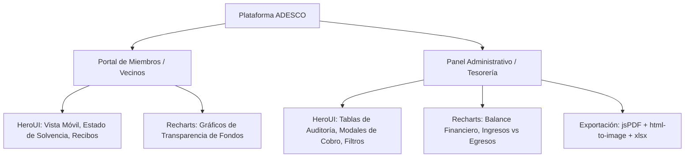

# ADESCO Dashboard & UI Stack Guide

Esta habilidad proporciona patrones de diseño, componentes y estándares de implementación para la plataforma de gestión de la **ADESCO (Asociación de Desarrollo Comunal)**, dividida en dos contextos: **Portal para Miembros (Vecinos)** y **Panel de Administración (Junta Directiva/Tesorería)**.

---

## 1. Separación de Roles y Responsabilidades



| Contexto | Usuarios | Componentes Clave | Librerías Principales |
| :--- | :--- | :--- | :--- |
| **Portal de Miembros** | Vecinos y Residentes | Consulta de solvencia, descarga de recibos propios, desglose visual de gastos comunales. | HeroUI (Cards, Chips, Modales), Recharts (PieChart simple). |
| **Panel de Administración** | Junta Directiva / Tesorero / Auditor | Registro de ingresos/egresos, conciliación bancaria, libro de caja, emisión de recibos, auditoría de usuarios. | HeroUI (Table, Modal, Form, DatePicker), Recharts (BarChart, AreaChart), jsPDF, html-to-image, xlsx. |

---

## 2. Guía de Uso de HeroUI

### A. Badges y Estados de Solvencia
Utiliza `Chip` de HeroUI para indicar visualmente el estado de cuentas de cada casa/lote:

```tsx
import { Chip } from '@heroui/react';

export function SolvencyStatusChip({ status }: { status: 'solvente' | 'pendiente' | 'mora' | 'anulado' }) {
  const colorMap = {
    solvente: 'success',
    pendiente: 'warning',
    mora: 'danger',
    anulado: 'default',
  } as const;

  const labelMap = {
    solvente: 'Solvente',
    pendiente: 'Pendiente de Pago',
    mora: 'En Mora',
    anulado: 'Anulado',
  };

  return (
    <Chip color={colorMap[status]} variant="flat" size="sm">
      {labelMap[status]}
    </Chip>
  );
}
```

### B. Tablas de Auditoría y Listado de Pagos
Usa `Table`, `TableHeader`, `TableBody`, `TableRow`, `TableCell`, y `Pagination` de HeroUI:

```tsx
import { Table, TableHeader, TableColumn, TableBody, TableRow, TableCell, Pagination } from '@heroui/react';

// Estándar para tablas de tesorería y auditoría
// - Búsqueda por número de casa o nombre del titular
// - Paginación en cliente o servidor (10 a 25 filas)
// - Acciones rápidas (Ver comprobante, Descargar recibo PDF, Anular)
```

### C. Modales de Cobro y Registro Rápido
Usa `Modal`, `ModalContent`, `ModalHeader`, `ModalBody`, `ModalFooter` con validación de formularios:
- Selección de Casa/Lote
- Selección de Tipo de Cuota (Mantenimiento, Agua, Seguridad, Aportación Extraordinaria)
- Método de pago (`Efectivo`, `Transferencia`, `Cheque`, etc.)
- Carga de archivo de comprobante

---

## 3. Guía de Uso de Recharts para Finanzas de la ADESCO

### A. Balance Comparativo Mensual (Ingresos vs Egresos)
Ideal para el panel administrativo y rendición de cuentas anual o mensual:

```tsx
import { ResponsiveContainer, BarChart, Bar, XAxis, YAxis, Tooltip, Legend, CartesianGrid } from 'recharts';

interface MonthlyMovement {
  mes: string;
  ingresos: number;
  egresos: number;
}

export function CashFlowBarChart({ data }: { data: MonthlyMovement[] }) {
  return (
    <div className="w-full h-80">
      <ResponsiveContainer width="100%" height="100%">
        <BarChart data={data} margin={{ top: 20, right: 30, left: 20, bottom: 5 }}>
          <CartesianGrid strokeDasharray="3 3" opacity={0.2} />
          <XAxis dataKey="mes" />
          <YAxis tickFormatter={(val) => `$${val}`} />
          <Tooltip formatter={(value: number) => [`$${value.toFixed(2)}`, '']} />
          <Legend />
          <Bar dataKey="ingresos" name="Ingresos" fill="#10b981" radius={[4, 4, 0, 0]} />
          <Bar dataKey="egresos" name="Egresos" fill="#ef4444" radius={[4, 4, 0, 0]} />
        </BarChart>
      </ResponsiveContainer>
    </div>
  );
}
```

### B. Desglose de Gastos Comunitarios (Transparencia para Vecinos)
Usa `<PieChart>` o gráfico de dona para que los miembros entiendan en qué se invierten sus cuotas:

```tsx
import { ResponsiveContainer, PieChart, Pie, Cell, Tooltip, Legend } from 'recharts';

const COLORS = ['#3b82f6', '#10b981', '#f59e0b', '#8b5cf6', '#ec4899'];

export function ExpenseBreakdownChart({ data }: { data: { categoria: string; total: number }[] }) {
  return (
    <div className="w-full h-72">
      <ResponsiveContainer width="100%" height="100%">
        <PieChart>
          <Pie
            data={data}
            dataKey="total"
            nameKey="categoria"
            cx="50%"
            cy="50%"
            innerRadius={60}
            outerRadius={90}
            paddingAngle={4}
          >
            {data.map((_, index) => (
              <Cell key={`cell-${index}`} fill={COLORS[index % COLORS.length]} />
            ))}
          </Pie>
          <Tooltip formatter={(val: number) => `$${val.toFixed(2)}`} />
          <Legend />
        </PieChart>
      </ResponsiveContainer>
    </div>
  );
}
```

---

## 4. Pipeline de Exportación y Reportes de Auditoría

### A. Exportar Gráfico como Imagen para Asambleas (`html-to-image`)
```typescript
import { toPng } from 'html-to-image';

export async function exportChartAsImage(elementId: string, filename: string = 'grafico-adesco.png') {
  const node = document.getElementById(elementId);
  if (!node) return;
  
  const dataUrl = await toPng(node, { quality: 0.95 });
  const link = document.createElement('a');
  link.download = filename;
  link.href = dataUrl;
  link.click();
}
```

### B. Generar Corte de Caja y Recibos en PDF (`jspdf` + `jspdf-autotable`)
```typescript
import jsPDF from 'jspdf';
import autoTable from 'jspdf-autotable';

export function generateAuditPdfReport({
  periodo,
  ingresos,
  egresos,
  balance,
  movimientos,
}: {
  periodo: string;
  ingresos: number;
  egresos: number;
  balance: number;
  movimientos: Array<{ fecha: string; concepto: string; tipo: string; cantidad: number }>;
}) {
  const doc = new jsPDF();

  // Encabezado
  doc.setFontSize(16);
  doc.text('ADESCO - REPORTE FINANCIERO Y AUDITORÍA', 14, 20);
  doc.setFontSize(10);
  doc.text(`Período: ${periodo}`, 14, 28);
  doc.text(`Balance Neto: $${balance.toFixed(2)} (Ingresos: $${ingresos.toFixed(2)} | Egresos: $${egresos.toFixed(2)})`, 14, 34);

  // Tabla de movimientos
  autoTable(doc, {
    startY: 42,
    head: [['Fecha', 'Concepto', 'Tipo', 'Monto']],
    body: movimientos.map((m) => [
      m.fecha,
      m.concepto,
      m.tipo.toUpperCase(),
      `$${m.cantidad.toFixed(2)}`,
    ]),
    theme: 'grid',
    headStyles: { fillColor: [41, 128, 185] },
  });

  doc.save(`reporte-adesco-${periodo}.pdf`);
}
```

### C. Descarga de Libro Contable a Excel (`xlsx`)
```typescript
import * as XLSX from 'xlsx';

export function exportTransactionsToExcel(data: Record<string, unknown>[], filename: string = 'libro-contable-adesco.xlsx') {
  const worksheet = XLSX.utils.json_to_sheet(data);
  const workbook = XLSX.utils.book_new();
  XLSX.utils.book_append_sheet(workbook, worksheet, 'Movimientos');
  XLSX.writeFile(workbook, filename);
}
```

---

## 5. Buenas Prácticas y Reglas del Proyecto

1. **Cumplimiento de RLS y Roles en Supabase:**
   * Las vistas de miembros solo deben consultar recibos donde `user_id == auth.uid()` o el ID de la casa asociada.
   * La vista de tesorería requiere rol administrativo (`rol === 1` o políticas RLS correspondientes).
2. **Formateo de Moneda Local:**
   * Utilizar siempre formateadores estándar con 2 decimales (`Intl.NumberFormat('es-SV', { style: 'currency', currency: 'USD' })`).
3. **Manejo de Errores y Tipado:**
   * Nunca usar `any`; definir interfaces claras para cada movimiento (`IIngreso`, `IEgreso`, `IRecibo`).
   * Mantener compatibilidad con ECMAScript Modules (`import` / `export`).
